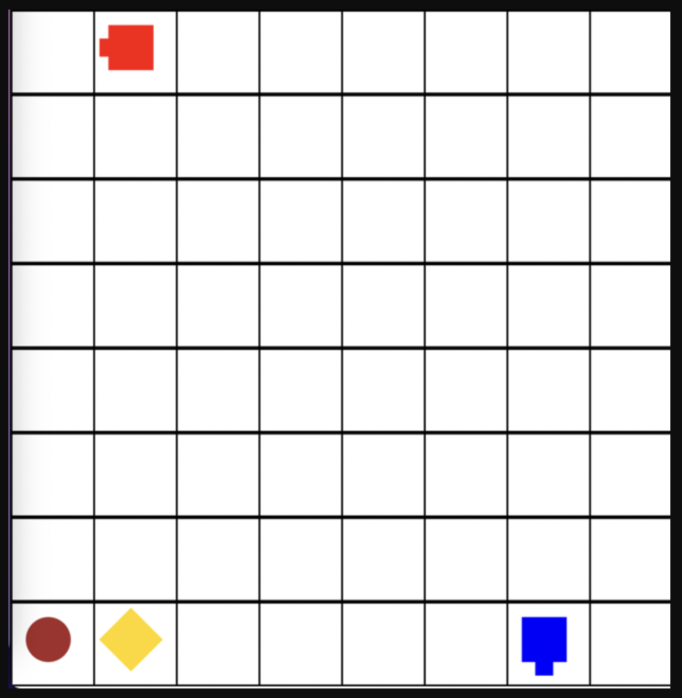
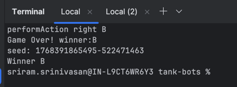
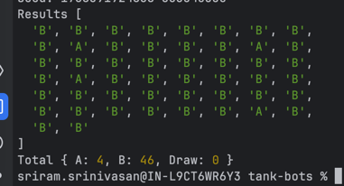

# Welcome to Tank BOTS!
This is a developer bot competition game, where 2 developers bot fight.

## Intro


- The above image shows the game arena. It has 8x8 blocks.
- Each game is fought between 2 tanks, bot A and bot B.
- There are 120 rounds in the game. 1 round is somewhat equal to 1 second.
- A bot can only make 1 move per round.
- It can either move forward, rotate, shoot.
- The tank/bot can only move in the direction it is facing.
- A diamond spawns in the game, which can be collected by the bots/tanks by reach to their positions.
- A bullet spawns in the game randomly too, which can be collected too.
- A tank can shoot another tank if it has bullet and it is in the same line(horizontally or vertically).
- At end of 120 rounds nobody shoots other, then the tank with highest diamonds win.
- If 2 tanks shoot each other at same round, then the bullets get cancelled.
- The tanks have only 1 bullet at beginning of the game.
- If 2 tanks land in same position, they both get destroyed and game ends, who ever has highest diamonds win.

## How to play
- We have few sample bots at `bots` folder, `/random.cjs` etc. 
- You can clone them and create your own file and modify them later.
- To run the game you can use ```node fight.cjs <bot1_path> <bot2_path>``` command.
- Example command: ```node fight.cjs bots/botA.cjs bots/botB.cjs```.
- For start you can try `node fight.cjs bots/random.cjs bots/basic.cjs`.



- The above command will execute the game and create a `march.json` file in `src/` folder.
- Once you have that file you can play the game in browser using `npm run dev`.
- Commit your bot to the same `bots/` folder once you created one, so others can compete and train their bots.

### Improve your bot
To improve your bot, you need to play multiple times with all other bots, for that we 
created this command below, which will fight that opposition 50 times. You can modify that to more
if you like in the `fight50.cjs`.

```node fight50.cjs <bot1_path> <bot2_path>```



### Hide your Bot code
If everyone reveals thier Bot code logic, there will be no competition. So we suggest everyone to obfuscate your 
bot code using the below function. 

```npx javascript-obfuscator bots/mybot.cjs --output bots/<yourname>.cjs ```

Best practice is to write your code in `bots/mybot.cjs` file(you need to create it), which is already added in .gitignore so it will
not be pushed to repo. And we included the above command in `package.json` inside 
```npm run bot-compile```
So you can just execute above after modifying your output name in `package.json` and your obfuscated bot should be ready.

### The leading bot
```node fightall.cjs```

Command finds all bots in `/bots` folder and fights every bot with other bot 200 times and gives you the wins.
Thus showcasing the leading bot currently.

**To see the current bot rankings goto: https://sriramdazn.github.io/tank-bots/**

